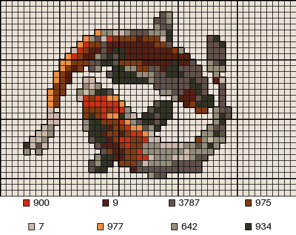
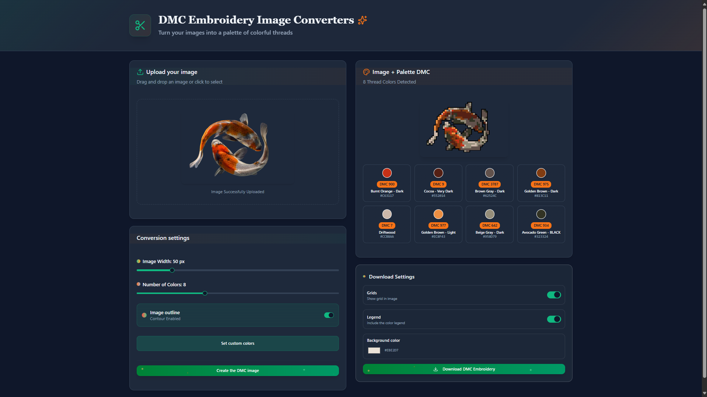
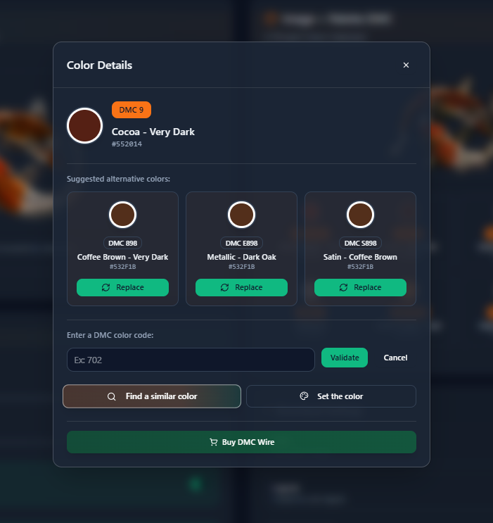
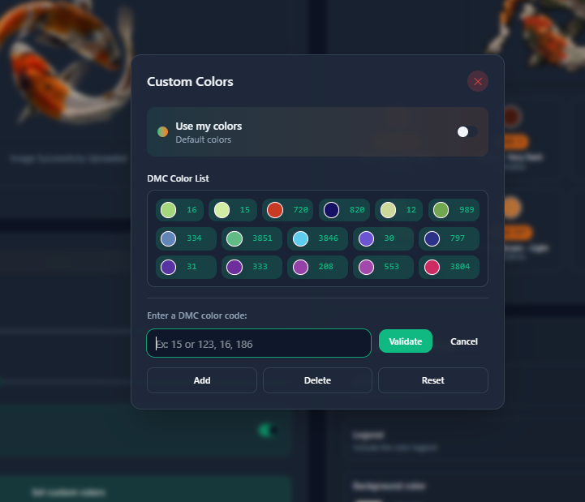

# Pixel Embroidery Converter

Pixel Embroidery Converter is a web application that transforms any image into a pixelized cross-stitch pattern using the DMC thread color palette. Built with **ReactJS**, **TailwindCSS**, and a **Python backend**, it provides a flexible and creative experience for hobbyists and crafters.

---

## Features

- **Image to Cross-Stitch**: Convert any image into a pixelated embroidery pattern using the DMC color palette.
- **Custom Color Mapping**: Change the assigned colors for each pixel to match your preferences.
- **Color Suggestions**: Get the nearest alternative DMC shades for any matched thread.
- **Your Own Thread Box**: Restrict the match to DMC codes you already own.
- **Colour Highlight**: Hover a thread to light up every stitch in that color.
- **Pixelization Level**: Adjust the pattern width in stitches to control the level of detail.
- **Black Outline Option**: Enable or disable a black outline on the cross-stitch points for better visibility.
- **Bilingual**: Full French / English UI with a language switch (persisted per browser).

---

## Tech Stack

- **Frontend**: React 19 + React Router + TailwindCSS 4 (Vite)
- **Backend**: Python / FastAPI (image processing and DMC matching)

---

## Usage

- **VPS (current)** — http://164.132.99.194:8080
- Render (previous) — https://picturetodmc.onrender.com/

---

## Deployment

Every push to `main` builds the frontend and ships it with the backend to the
VPS over SSH (`.github/workflows/deploy.yml`). Roughly 40 seconds end to end.

| | |
| --- | --- |
| Host | `164.132.99.194`, SSH on port **2007** |
| Public URL | **http://164.132.99.194:8080** |
| nginx | listens on `:8080`, proxies to `127.0.0.1:8001` |
| Service | `picturetodmc.service` (uvicorn, 1 worker) |
| Code | `/var/www/picturetodmc/app` |
| Virtualenv | `/var/www/picturetodmc/venv` (Python 3.13 via `uv`) |

The box also runs **emoji-art** on ports 80/443. The two share the `deploy`
user but nothing else; this site got a port rather than a hostname because it
has no domain yet. Give it one and the nginx `:8080` block becomes a normal
443 server block.

### Server install (once)

```bash
ssh-keygen -t ed25519 -f ci_key -N "" -C "github-actions-picturetodmc"
scp -P 2007 -r deploy ci_key.pub ubuntu@164.132.99.194:/home/ubuntu/
ssh -p 2007 ubuntu@164.132.99.194 \
    'sudo bash /home/ubuntu/deploy/setup-vps.sh /home/ubuntu/ci_key.pub'
gh secret set SSH_PRIVATE_KEY < ci_key      # the private half, in this repo
```

`setup-vps.sh` is idempotent — re-run it after editing anything in `deploy/`.

**Why `uv`:** the VPS ships Python 3.14 only, and none of the pinned versions
(`pillow==11.3.0` above all) publish wheels for it. `uv` fetches a standalone
3.13 into `/opt/uv-python`; the system interpreter is left alone.

**Why one uvicorn worker:** `PythonDCA/main.py` keeps the active conversion in
a module-level global (`main_instance`), so a second worker would answer
`/download` with somebody else's pattern. Fix that before scaling out.

### Day-to-day

```bash
ssh -p 2007 ubuntu@164.132.99.194
systemctl status picturetodmc
journalctl -u picturetodmc -f
gh run list --limit 5        # deployment history
gh workflow run Deploy       # redeploy without a commit
```

---

## Pages

| Route       | What it is                                                              |
| ----------- | ----------------------------------------------------------------------- |
| `/`         | Landing page — hero, how it works, features, FAQ, closing CTA           |
| `/convert`  | The converter workbench: settings left, fabric centre, threads right    |
| `/gallery`  | Finished-piece gallery with category filters                            |
| `*`         | Not-found page                                                          |

Client-side routed. The backend's catch-all in `main.py` returns `index.html`
for any non-API GET, so deep links like `/gallery` work on a hard refresh.
This is why `vite.config.ts` sets `base: "/"` and not `"./"`.

---

## Design system

The UI implements the **"Picture to DMC — Design System"** Claude Design
project. The tokens live in one place, `frontend/src/index.css`, as a
Tailwind 4 `@theme` block: warm neutrals (blanc / linen / aida / taupe /
cocoa / ink), five DMC accent threads, the Fredoka / Nunito Sans / Shantell
Sans type trio, radii and warm diffuse shadows.

Two rules worth keeping:

- **Coral (DMC 350) is the only color that asks for a click.** One primary
  action per screen; the other four accents are decoration, state and data.
- **No pure white, no pure black.** Everything sits on a warm linen tone.

Recurring motifs have utilities rather than being re-declared: `aida`
(fabric weave, `--aida-size` / `--aida-ink`), `bobbin` / `bobbin-sm` (floss
spool shading), `underline-stitch` (the wavy golden underline).

### Brand assets

The mark is the embroidery hoop with a threaded needle. The master lives at
`frontend/src/assets/Icon.png` (888 x 913) and is **not** shipped — it is
only the source. The sizes actually served come from `frontend/public/`:

| File                   | Used by                                     |
| ---------------------- | ------------------------------------------- |
| `icon-256.png`         | `<BrandMark>` everywhere in the app          |
| `favicon-32.png`       | browser tab                                  |
| `favicon-192.png`      | high-DPI tab, Android                        |
| `apple-touch-icon.png` | iOS — flattened onto linen, iOS blackens alpha |

Regenerate them from the master with Pillow if the artwork changes; keep the
aspect ratio, and keep `MARK_RATIO` in `components/brand/logo.tsx` in sync.

---

## Project Structure

```
PythonDCA/            FastAPI backend (image processing + DMC matching)
  main.py               API routes, also serves the built frontend
  picture.py            KMeans color reduction
  csvValues.py          DMC chart lookup (DMCcharts2025.xlsx)
  dist/                 frontend build — committed, this is what Render serves
frontend/public/        favicons + the served logo sizes
frontend/src/
  assets/Icon.png       brand mark master (not shipped)
  routes/               one file per page
  components/brand/     logo, pixel art, bobbins, the stitched-X icon family
  components/converter/ dropzone, canvas, thread list, dialogs, download
  components/layout/    header, footer, language switch
  components/ui/        button, card, pill, slider, switch, dialog
  i18n/                 dictionary.ts (fr + en), provider, useI18n hook
  lib/api.ts            typed backend client
  index.css             design tokens
```

---

## Running Locally

### Backend

Requires Python 3.10+. **Pillow must stay on 11.3.0** — `contouring()` uses
`ImageFilter.MaxFilter(1)`, which hard-crashes the process on Pillow 12.x with no traceback.

```bash
python -m venv .venv
.venv/Scripts/activate          # Linux/macOS: source .venv/bin/activate
pip install -r PythonDCA/requirements.txt

python -m PythonDCA.main        # must run as a module (relative imports)
```

Serves on http://localhost:10000 (override with the `PORT` env var). This already
gives you the full app: the backend serves `PythonDCA/dist/`.

### Frontend (hot reload)

Only needed to work on the UI. Keep the backend running in another terminal.

```bash
cd frontend
npm install
npm run dev                     # http://localhost:5173 (next free port if taken)
```

API calls are same-origin and proxied to the backend by `vite.config.ts`
(override the target with `VITE_BACKEND_URL`).

### Building the frontend

```bash
cd frontend
npm run build                   # outputs to ../PythonDCA/dist
```

Commit the regenerated `PythonDCA/dist/` — Render deploys that build, it does not
compile the frontend itself.

---

## Render






